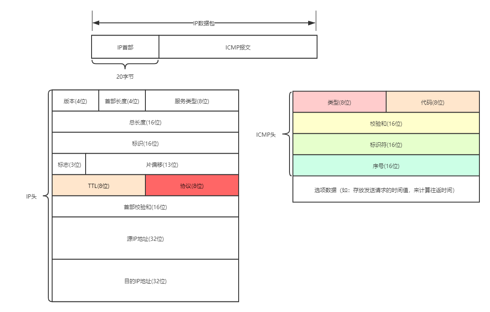
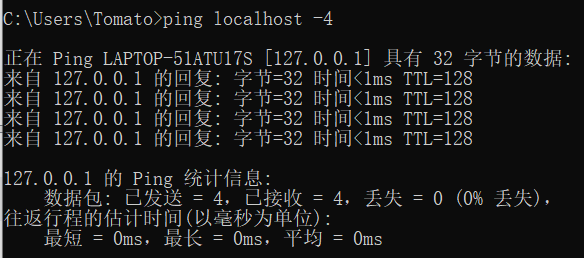
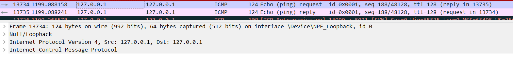
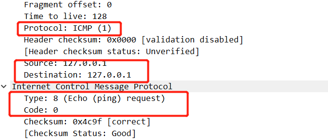
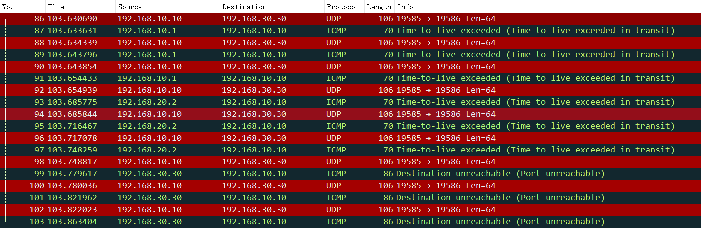
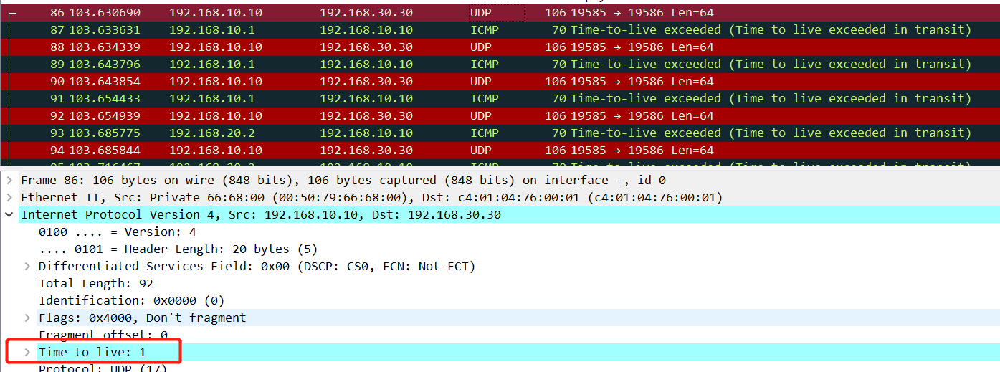
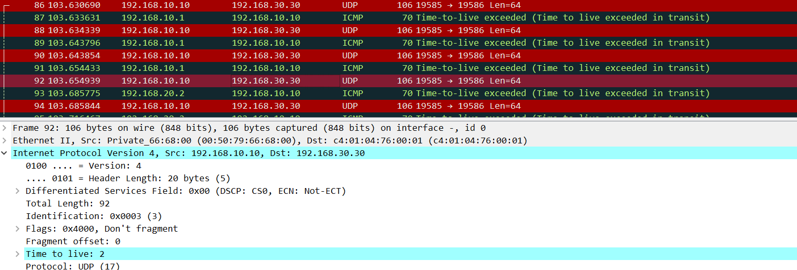
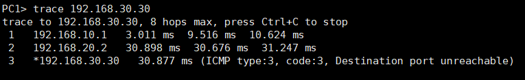
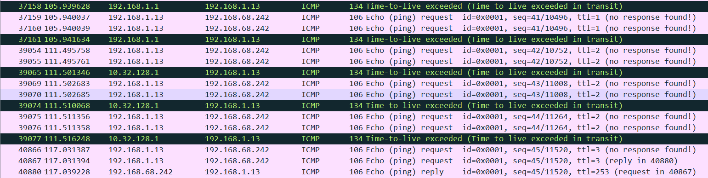

### ICMP协议介绍

在日常工作中，我们通常会用到 ping、tracert(traceroute)命令来检测网络链路状况和跟踪路由。Ping 和 tracert(traceroute)是基于 ICMP 协议工作的，我们首先来了解 ICMP 到底是什么？

ICMP(Internet Control Message Protocol)，因特网控制报文协议，它的作用就是确认IP包是否成功送达目标地址，如果某个 IP 包未能达到目标地址，则会通过ICMP包告知IP数据包传输失败的原因。ICMP 报文封装到 IP 数据包里进行传输，不经过传输层，但我们通常认为 ICMP 协议是 IP 层的附属协议，属于网络层的协议。ICMP 的报文格式如下：

 

在 ICMP 首部格式中，类型字段(8为)大致标识了两种不同 ICMP 类型，常见类型的标识如下所示：

* 查询报文类型，用于诊断的查询信息
    * 0:回送应答(Echo Reply)
    * 8:回送请求(Echo Request)
* 差错报文类型，用于通知出错原因的错误消息
    * 3:目标不可达(Destination Unreachable)
    * 4:原点抑制(Source Quench)
    * 5:重定向或改变路由(Redirect)
    * 11:超时(Time Exceeded)

查询报文两种类型的回送消息常用于判断通信的主机或路由器之间，所发送的数据包是否已经成功到达对端，发送端构造回送请求消息并发送给目标主机，目标主机接收到回送请求消息后，如果正常返回回送应答消息，那么发送端到接收端之间是可达的。

再看几种典型的差错报文类型：

>  目标不可达:3
当路由器无法将IP数据包发送给目标地址时，会给发送端主机返回一个目标不可达的 ICMP 消息，结合 ICMP 首部格式中的代码字段告知发送端不可达的具体原因。

常见的不可达原因有：

* 0：网络不可达（Network Unreachable）
    * 通常情况下，当路由器中的路由器表匹配不到 IP 的网络号时，就会通过 ICMP 消息告知发送端主机"网络不可达"。
* 1：主机不可达（Host Unreachable）
    * 通常情况下，当路由表中没有该主机的信息，或者该主机没有连接到网络中，路由器就会通过 ICMP 消息告知发送端主机"主机不可达"。
* 2：协议不可达（Protocol Unreachable)
    * 当主机以某种协议访问对端主机时，如果对端主机的防火墙已经禁止该协议进行访问，那么会通过 ICMP 消息告知发送端主机"协议不可达"。
* 3：端口不可达（Port Unreachable）
    * 当主机访问对端主机端口 A 时，此时对端主机并没有进程监听 A 端口，那么会通过 ICMP 消息告知发送端主机"端口不可达"。
* 4：数据包太大需要分片但不允许分片（Fragmentation needed but no frag）
    * 路由器在转发数据包的过程中，若数据包的大小超过 MTU，继续转发数据包，需要将数据包进行分片，此时如果数据包首部的 DF(Don't Fragment) 字段为 1 ，那么路由器会直接丢弃该数据包，通过 ICMP消息告知发送端主机数据发送失败的原因为数据包太大需要分片但不允许分片。

>  原点抑制:4
当链路发送拥塞时，通过向发送端主机发送原点抑制消息告知主机链路发生了拥堵的情况，从而增大数据包发送的时间间隔，达到减少网络拥堵的目的。

>  重定向消息:5
如果路由器发现发送端主机使用了「不是最优」的路径发送数据，那么它会返回一个 ICMP 重定向消息告知主机更合适的路由信息。

>  超时消息:11
从IP数据包首部格式中我们可以看到有个`TTL(Time to Live)`的字段，每经过一次路由器，它的值就会减1，直到减到0时，该数据包就会被丢弃，此时路由器就会发送一个ICMP 超时消息通知发送端主机该数据包已被丢弃。
设置 TTL 的主要目的，是为了避免在路由环路的情况下，IP 包无休止地在网络上被转发。

### ping命令工作过程

现有主机A（192.168.0.1）和主机B（192.168.0.2），我们在主机A上输入命令：ping 192.168.0.2之后：

主机A构建一个 ICMP回送请求消息数据包。ICMP 首部的类型字段会设置为 8，代表回送请求消息类型；序号字段则是用于区分连续发送 ping 命令时的不同数据包，每发出一个请求数据包，序号会加 1。在报文的数据部分也不会添加发送时间，用于计算往返时间 RTT。

然后 ICMP协议会将这个数据包以及目标IP（192.168.0.2）等信息一同交给IP层处理。IP层协议得到这些信息后，将源地址（即本机IP）、目标地址（即目标IP：192.168.0.2）、协议字段(1)，以及其它的控制信息，构建成一个IP数据包。

IP数据包构建完成后，再交给数据链路层处理，加上 MAC 首部。此时本地 ARP 映射表中若包含目标 IP (192.168.0.2)的映射关系，那么直接取出对应的 MAC 地址并添加到 MAC 首部目的 MAC 字段。若映射表中不包含目标IP，则需要发送 ARP 查询 MAC 地址，获得 MAC 地址后，再构建链路层的数据帧。

当主机B收到这个数据帧之后，会首先检查它的目标MAC地址是不是本机，如果是就接收下来处理，将数据帧中的 IP 数据包取出来，交给本机的IP层协议，然后IP层协议检查完之后，再将 ICMP 数据包取出来交给 ICMP 协议处理，当这一步处理完成之后，就会构建一个 ICMP 回送响应数据包，ICMP 首部的类型字段会设置为 0，序号字段设置为接收到的请求数据包中的序号，然后回送给主机A。

在一定的时间内，如果主机A收到了应答包，则说明它与主机B之间网络可达，如果没有收到，则说明网络不可达。源主机根据接收到的应答数据包的时间和发送请求数据包的时间计算出ICMP 数据包的时间延迟。

如果两台主机不在同一个网段，那么还会涉及到网关、路由器的转发，但是 ICMP 消息的构造依旧是不变的，路由器将数据包转发另一个网段时需要修改 MAC 帧首部源 MAC 地址字段的值。可以看出，在整个 ping 程序的执行过程中使用了 ICMP 里面的 ECHO REQUEST（回送请求：8 ） 和 ECHO REPLY （回送应答：0）两种报文类型。

### Ping 命令案例分析

#### Localhost、127.0.0.1和本机ip的区别
我们通过 Ping 程序来检测本机到目标主机的网络状况，在构建 IP 包的过程中，我们需要将本机 IP 地址设置为源IP，在现实场景中，我们经常也会看到 localhost, 127.0.0.1，这与本机 IP 又有何联系，如果我们分别 ping localhost 和 127.0.0.1又会是什么样呢？继续往下分析。

首先我们来 ping localhost:

 

从图中可以看出，ping localhost的过程中，会解析成 ping 127.0.0.1，这是因为 localhost 是一个域名，从hosts 文件中可以看出，这个域名是预定义的，它默认指向的是 127.0.0.1 这个 IP 地址。

127.0.0.1 被称作环回地址，它是主机用于向自身发起通信的一个特殊地址，包含环回地址的IP数据包不会到达外部网络接口，离开主机的包，也就是说：IP 数据包不会通过数据链路层，物理层，以太网传出去，而是可以直接在自己的网络层，运输层进行处理。当操作系统初始化本机的TCP/IP协议栈时，设置协议栈本身的IP地址为127.0.0.1（保留地址），并注入路由表。当IP层接收到目的地址为127.0.0.1的数据包时，不调用网卡驱动进行二次封装，而是立即转发到本机IP层进行处理，当我们禁用网卡后，ping 127.0.0.1也是能 ping 通的。

 

通过抓包我们可以看到 ping 过程中ICMP Echo Request 消息和 ICMP Echo Reply消息的交互过程，查看数据包内容可以看到ICMP报文首部字段以及IP数据包首部字段的数据：

 

IP 数据包中协议字段通过设置为 1 来标识 ICMP 协议，同事设置源地址和目的地址都为 127.0.0.1，在ICMP 首部格式中，设置类型来区分回送应答以及回送请求，不管是回送应答的报文还是回送请求的报文，代码(Code)字段都设置为 0。

最后我们再来看本地 IP 地址，通常情况下，“本机IP地址”指的是“本机物理网卡所绑定的网络协议地址”。我们 ping 本地 IP，通过抓包可以看到，只能在环回接口抓到相应的数据包，所以数据包同样不会通过网卡转发出去，但是如果禁用网卡，这时驱动程序未能获得本地主机IP，再 ping 本地 IP，我们可以看到会有“PING:传输失败。常见故障”的提示信息。

### Traceroute/Tracert 命令工作过程

#### Traceroute

前面我们讲到 ping 命令用到 ICMP 中的查询报文来检测链路的状况，而 traceroute 命令则是利用了 ICMP 差错报文来实现。我们通过 wireshark 抓包来分析路由跟踪的整个过程，

 

源主机通过 traceroute 追踪路由时，首先会构造 UDP 报文段，并通过 IP 数据包封装。

 

在 IP 数据包首部会设置特殊的TTL值，来追踪源主机和目标主机之间的路由。首先它给目标主机发送一个 TTL=1 的数据包，那么这个数据包一旦在路上遇到一个路由器，TTL就变成了0（TTL规则是每经过一个路由器都会减1），因为TTL=0了，所以路由器就会把这个数据包丢掉，然后产生一个错误类型（超时:11）的 ICMP 报文回发给源主机。这个时候源主机就拿到了第一个路由节点相关信息了。

 

接着，源主机再给目标主机发一个 TTL=2 的数据包，依旧上述流程走一遍，就知道第二个路由节点的IP和耗时情况等信息。如此反复进行，traceroute 就可以拿到从主机A到主机B之间所有路由器的信息了。

你可能会有疑问，数据包到达目标主机时，此时 TTL 的值应该为 1，那此时目标主机应该怎么回复源主机？在源主机构造 UDP 报文段的时候，会设置一个完全无法到达的目的端口号(大于30000)，那么此时目标主机会返回给源主机端口不可达的 ICMP 差错报文。当源主机收到差错报文类型是端口不可达时，说明发送方发出探测包到达了目标主机。从抓包数据中我们也可以看出，一条路径上的每个设备 traceroute 要测3次，我们可以得到每次测试的传输时延等信息。

 

#### Tracert

与 traceroute 不同的地方是，tracert 通过构造 ICMP 查询报文类型来跟踪源地址到目的地址的路由。

 

源主机首先向目的地址发出一个ICMP回送请求（ICMP Echo request）数据包，并将TTL设置为1，经过路由器时，TTL会被减1。当TTL变为0时，包被丢弃，路由器向源地址发回一个ICMP超时通知（ICMP Time Exceeded Message），内含发送IP包的源地址，IP包的所有内容及路由器的IP地址。当源地址收到该ICMP包时，显示这一跳路由信息。

接着，源主机再给目标主机发一个 TTL=2 的数据包，依旧上述流程走一遍，就知道第二个路由节点的IP和耗时情况等信息。如此反复进行，直至目标地址收到探测数据包，并返回ICMP回应答复（ICMPEcho Reply），当源地址收到ICMP Echo Reply包时停止 tracert，这样便拿到从主机A到主机B之间所有路由器的信息。

